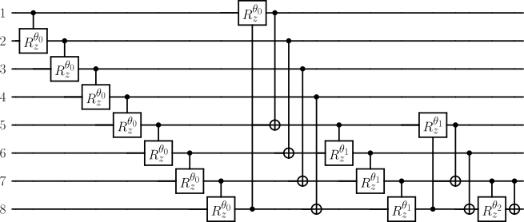

# Dynamic QCNNs


<p style="height:155px">
<code>dynamic_qcnn</code> is an open-source python package for the dynamic creation of QCNNs by system or hand. It includes primitives: <code>Qconv, Qpool, Qdense, Qfree </code> that can be stacked together hierarchically to form QCNN circuit architectures. 

*A robot building itself with artifical intelligence, pencil drawing -  generated with* [Dall E 2](https://openai.com/dall-e-2/)
</p>

# Example usage
```python
from dynamic_cnn import Qconv, Qpool, Qfree
qcnn = Qfree(8) + (Qconv(stride=1) + Qpool(filter="right")) * 3
```
$\text{QCNN:}$


```python
### Reverse binary tree
from dynamic_cnn import Qconv, Qpool, Qfree
# motif: level 1
m1_1 = Qconv(1)
m1_2 = Qpool(filter="left")
# motif: level 2
m2_1 = m1_1 + m1_2
# motif: level 3
m3_1 = Qfree(8) + m2_1 * 3
```
$m^3_1\rightarrow \text{QCNN}:$


```python
# extending follows naturally, repeating the above circuit 5 times is just:
m3_1 * 5
```